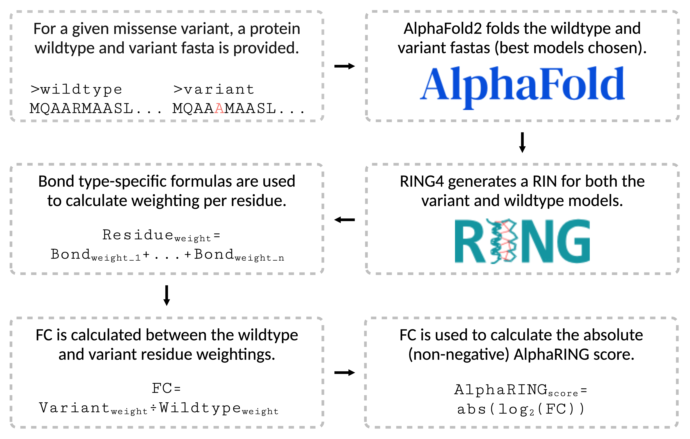

# AlphaRING

AlphaRING is a customised implementation of [AlphaFold2](https://github.com/google-deepmind/alphafold) that uses the [RING4](https://ring.biocomputingup.it/) standalone package to capture non-covalent interactions at the atomic level in monomeric protein models. By piping together AlphaFold2 and RING4, AlphaRING extends upon both package's capabilities to predict the pathogenicity of any given missense variant based on the predicted changes in non-covalent bond formation between the wild-type monomeric protein model and its missense variant counterpart.

An associated AlphaRING paper is currently under review by the [RECOMB 2025](https://recomb.org/recomb2025/index.html) conference and will be made available upon completion. Additionally, the AlphaRING benchmark dataset and the code used to generate it will be made available soon. 

## Overview

<picture>
  <source media="(prefers-color-scheme: dark)" srcset="./images/fig_1.png">
  <source media="(prefers-color-scheme: light)" srcset="./images/fig_1.png">
  
</picture>

 <strong>Figure 1</strong> Overview of the AlphaRING workflow 

For any given missense variant, AlphaRING conducts the following workflow

1. **Accept FASTAs**: 

   In this step, AlphaRING accepts two FASTAs: firstly, a FASTA representing a monomeric wild-type protein, and secondly, a FASTA representing a monomeric missense variant protein. We define a  
   missense variant as differing from its paired wild-type by exactly one residue. AlphaRING will not accept anything else in place of this.

2. **Predict structures**: 

   In this step, AlphaFold2 is used to predict the three-dimensional structure of the wild-type and variant proteins. The best model of each is relaxed–to improve local geometry–and collected.
   
   [!NOTE]
   Whilst AlphaRING provides the AlphaFold2 neural network to make predictions, the user must download the genetic databases AlphaFold2 uses to make its predictions as per the package's 
   [guidelines](https://github.com/google-deepmind/alphafold?tab=readme-ov-file#installation-and-running-your-first-prediction).

4. **Perform residue interaction network (RIN) analysis**

   In this step, RING4 is used to generate a RIN of both the wild-type and variant models, capturing their non-covalent interactions at the atomic level. To this date, the RING4 standalone 
   package has not been open-sourced. Therefore, the user must reuqest a [RING4 licence](https://biocomputingup.it/services/download/), which is free for academic users. To ensure compatibility, 
   the user is advised to ask for RING4 version v4.0-2-ge939f57.

> [!NOTE]
> RING4 uses graph terminology, referring to bonds as "edges" and residues as "nodes". Therefore, these terms are frequently used throughout the source code of AlphaRING.

5. **Calculate residue weightings**

   In this step, AlphaRING assigns each non-covalent bond (hydrogen, ionic, π-cation, π-π stacking, and π-hydrogen) in the wild-type and variant RINs a weighting of importance to the stability 
   of the respective protein. The weightings are calculated using novel bond-type specific formulas that take into account bond-specific energy and geometry values provided per bond by RING4.

6. **Calculate fold change (FC)**:

7. **Calculate AlphaRING score**:

## Installation

## Usage

## Downstream analysis

